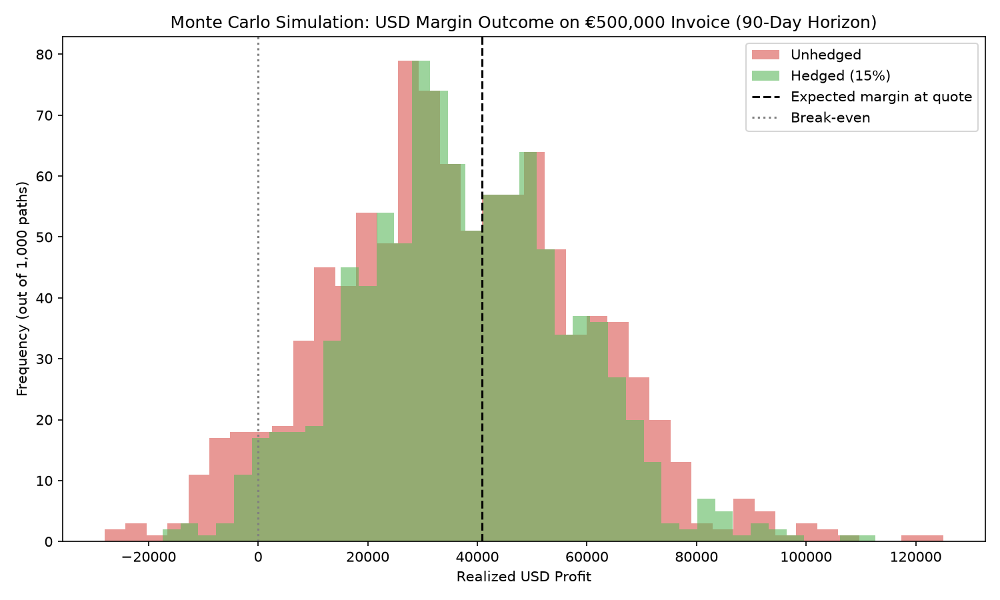

# FX Hedging Monte Carlo

Monte Carlo simulation of FX margin erosion on a EUR denominated trade receivable, comparing an unhedged position against a forward contract hedge.

**Live interactive demo:** open `index.html` (or enable GitHub Pages on this repo → Settings → Pages → deploy from branch → your link becomes `https://<username>.github.io/fx-hedging-model/`). It renders 1,000 simulated EUR/USD paths in an interactive 3D view with a live hedge-ratio slider that recomputes every risk metric in real time.

## The scenario

A US-based exporter invoices a customer **€500,000, payable in 90 days**, priced with an **8% profit margin** at quote-time spot. The USD cost base is fixed, so EUR depreciation over the 90-day window erodes, or wipes out, that margin at conversion.

## How it works

1. **Calibrate:** 2 years of daily EUR/USD data generated with a GARCH(1,1) volatility process (realistic volatility clustering); drift and volatility estimated from its log returns.
2. **Simulate:** 1,000 Geometric Brownian Motion paths (Itô-corrected drift), 90 daily steps each.
3. **Hedge:** a forward rate from covered interest-rate parity (1.5% annualized EUR-USD differential) locks a chosen share of the receivable.
4. **Measure:** profit distribution, 95% VaR, 95% CVaR / expected shortfall, and P(margin fully wiped out), hedged vs. unhedged.

## Key results (seed 7, n = 1,000)

| Metric | Unhedged | Hedged (15% forward) |
|---|---|---|
| Mean profit (USD) | 36,357 | 37,308 |
| Std dev of profit (USD) | 23,053 | 19,595 |
| 95% VaR (USD) | −1,855 | 4,828 |
| 95% CVaR (USD) | −9,203 | −1,418 |
| P(margin fully wiped out) | 5.90% | 2.50% |

**Reduction in USD margin volatility from the hedge: 15.0%**



## Run it

```bash
pip install pandas numpy matplotlib
python generate_fx_data.py        # creates eurusd_historical.csv
python fx_hedging_monte_carlo.py  # prints the risk report, saves the chart
```

## Files

- `generate_fx_data.py`: GARCH(1,1) mock EUR/USD history generator
- `fx_hedging_monte_carlo.py`: calibration, Monte Carlo engine, risk report, chart
- `index.html`: self contained interactive 3D visualization (no dependencies)
- `eurusd_historical.csv` and `fx_margin_erosion_simulation.png`: generated outputs
